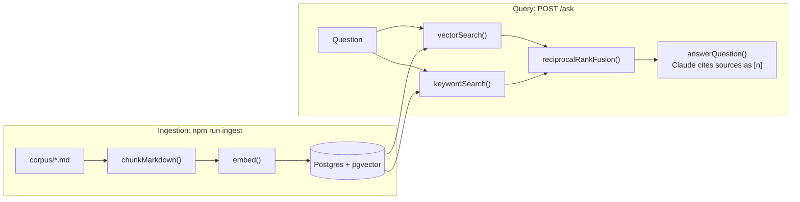

# RAG Docs Assistant

[](https://github.com/Tejas94/rag-assistant/actions/workflows/ci.yml)

Ask questions about a document set and get answers with numbered citations. Retrieval is
vector, keyword or hybrid (fused with Reciprocal Rank Fusion), and an eval report measures
both retrieval (recall@5, MRR) and answers (correct, faithful, abstains when it should).

**What it proves:** you can build retrieval that is measurably correct, not just a demo.

> Status: in progress. Project 2 of a 12-week AI engineering plan. See the
> [learning path](docs/LEARNING_PATH.md) for weeks 4-6 and the [roadmap](docs/ROADMAP.md)
> for taking it to production and beyond.

## How it works



Ingestion runs ahead of time and rebuilds the index. Every question then embeds the query,
searches the index two ways, fuses the rankings and hands the top chunks to Claude, which
answers only from them.

## Run it

```bash
nvm use                      # Node 22 (see .nvmrc)
npm install
cp .env.example .env         # add ANTHROPIC_API_KEY; VOYAGE_API_KEY after P2-02
npm run db:up                # Postgres 17 + pgvector on port 5433, schema applied
npm run ingest               # needs P2-01; uses the offline fake embedder until P2-02
npm run eval                 # retrieval metrics per mode, writes evals/report.md
npm run eval -- --answers    # also answers and judges every question (costs money)
npm run ask -- "How long are backups kept on Team?" hybrid
npm run dev                  # tiny web UI on http://localhost:3000
npm test                     # all tests; specs in tests/specs stay red until their TODO is done
npm run progress             # which TODOs are left
```

The sample corpus in `corpus/` is a made-up hosting company so everything runs on day one.
`npm run db:reset` wipes the database and re-applies `db/schema.sql`.

## Your TODOs

| ID | Week | File | What |
| --- | --- | --- | --- |
| P2-01 | 4 | `src/chunk.ts` | Heading-aware chunking with size limit and overlap |
| P2-02 | 4 | `src/embed.ts` | Real embeddings (Voyage, or OpenAI) with batching and retries |
| P2-03 | 4 | `src/retrieve.ts` | Vector search with pgvector |
| P2-04 | 5 | `src/retrieve.ts` | Keyword search with Postgres full-text search |
| P2-05 | 5 | `src/retrieve.ts` | Reciprocal Rank Fusion for hybrid search |
| P2-06 | 5 | `src/answer.ts` | Answer with [n] citations and "I don't know" handling |
| P2-07 | 6 | `evals/golden.jsonl` | Grow the golden set from 6 to 50 questions |
| P2-08 | 4 | `evals/metrics.ts` | recall@k and reciprocal rank |
| P2-09 | 6 | `evals/judge.ts` | LLM-as-judge, calibrated against 20 of your own labels |
| P2-10 | 6 | `corpus/` | Swap in a real document set and rewrite the golden set for it |

Suggested order: P2-01, P2-03, P2-08 (now `npm run eval` gives real numbers with the fake
embedder), P2-02 (watch the numbers move), P2-04, P2-05, P2-06, P2-07, P2-09, P2-10.

How the TODOs work:

- Every gap is marked `TODO(P2-nn)` and calls `todo()`, which throws "Not implemented yet:
  P2-05...", so the app, the CLI and the tests point straight at what is missing.
- A spec in `tests/specs` is red until its TODO is done. Green means done: move the file to
  `tests/core`, and CI guards it from then on.
- Delete the `TODO(P2-nn)` marker when you finish one. `npm run progress` and CI count what
  is left. Each CI run shows the progress table in its summary.

## Experiments worth writing up

Each one is a row in the results table below and a story for interviews: fake vs. real
embeddings; chunk size 300 vs. 1200 vs. whole section; vector vs. keyword vs. hybrid; with
and without the heading path in the embedded text; a cheaper answer model. Log them in
[docs/EXPERIMENTS.md](docs/EXPERIMENTS.md).

## Evals and results

Fill this in during week 6 from `evals/report.md`, then keep it current.

| Setup | Recall@5 | MRR | Correct | Faithful | Abstained correctly |
| --- | --- | --- | --- | --- | --- |
| Fake embedder, vector only | | | | | |
| Voyage, vector only | | | | | |
| Voyage, hybrid | | | | | |

Judge agreement with your own labels: _/20.

## Ship it (week 6)

- [ ] Deploy (Railway, Fly.io or Render with managed Postgres + pgvector)
- [ ] Keep the architecture diagram above in sync with what you built
- [ ] Fill in "Evals and results": the report before and after your best change, and the judge's agreement with your labels

## Working on it with Claude Code

`CLAUDE.md` asks Claude Code to act as a tutor in this repo. It explains, gives hints and
reviews your code, but leaves the TODOs to you unless you ask it to write one.
