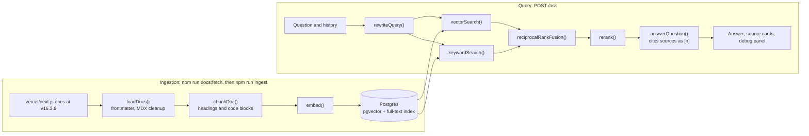

# Developer Docs Assistant

[](https://github.com/Tejas94/rag-assistant/actions/workflows/ci.yml)

Ask questions about the Next.js docs (pinned to v16.3.8) and get answers that cite the exact
section they came from. Retrieval is vector, keyword, hybrid or hybrid plus a reranker, and
an eval report measures retrieval (recall@5, MRR) and answers (correct, faithful, abstains
when the docs do not say) on a golden set of real developer questions.

**What it proves:** you can build retrieval over real documentation that is measurably
correct, cites its sources and says "I couldn't find that" instead of guessing.

> Status: in progress. Project 2 of a 12-week AI engineering plan. See the
> [learning path](docs/LEARNING_PATH.md) for weeks 4-6 and the [roadmap](docs/ROADMAP.md)
> for taking it to production and beyond.

## How it works



Ingestion runs ahead of time. It reads the pinned docs, strips the MDX markup but keeps
the code, splits each page into chunks that know their heading path, embeds them and
rebuilds the index in one transaction. Every question then searches the index two ways,
fuses the rankings, reranks the best candidates and hands the top five to Claude, which
answers only from them and cites each claim. Each citation links to the section on
nextjs.org, and a debug panel shows what every stage returned, with scores and timings.

## Run it

```bash
nvm use                      # Node 22 (see .nvmrc)
npm install
cp .env.example .env         # ANTHROPIC_API_KEY for answers; VOYAGE_API_KEY after P2-04
npm run db:up                # Postgres 17 + pgvector on port 5433, schema applied (Docker)
npm run docs:fetch           # sparse clone of the Next.js v16.3.8 docs into corpus/nextjs
npm run ingest               # needs P2-01; uses the offline fake embedder until P2-04
npm run eval                 # retrieval metrics per mode, writes evals/report.md
npm run eval -- --answers    # also answers and judges every question (costs money)
npm run ask -- "How do I revalidate a single page on demand?" hybrid
npm run dev                  # web UI on http://localhost:3000
npm test                     # all tests; specs in tests/specs stay red until their TODO is done
npm run progress             # which TODOs are left
```

No Docker? Any Postgres 15 or later with the pgvector extension works: set `DATABASE_URL`
and run `npm run db:schema`. `npm run db:reset` wipes the Docker database and re-applies
`db/schema.sql`.

Until a TODO is done, the code that needs it stops with `Not implemented yet: P2-nn`, the
CLI prints it, and the API answers 501 with the TODO id. The page, `docs:fetch` and the
tests work from day one.

## Your TODOs

| ID | Week | File | What |
| --- | --- | --- | --- |
| P2-01 | 4 | `src/chunk.ts` | Heading- and code-aware chunking |
| P2-02 | 4 | `src/retrieve.ts` | Vector search with pgvector |
| P2-03 | 4 | `evals/metrics.ts` | recall@k and reciprocal rank |
| P2-04 | 4 | `src/embed.ts` | Voyage embeddings with batching and retries |
| P2-05 | 5 | `src/retrieve.ts` | Keyword search with Postgres full-text search |
| P2-06 | 5 | `src/retrieve.ts` | Reciprocal Rank Fusion |
| P2-07 | 5 | `src/rerank.ts` | Reranking with safe fallback |
| P2-08 | 5 | `src/answer.ts` | Grounded answers with [n] citations and abstention |
| P2-09 | 6 | `evals/golden.ts`, `evals/golden.jsonl` | Grow the golden set to 50 questions |
| P2-10 | 6 | `evals/judge.ts` | LLM-as-judge calibrated against your labels |

Suggested order: the ids. After P2-01, P2-02 and P2-03, `npm run eval` gives real vector
numbers with the fake embedder; that is your baseline. P2-04 swaps in real embeddings, so
you watch the same numbers move. Week 5 adds the other modes and the answers, and week 6
makes the measurement trustworthy.

How the TODOs work:

- Every gap is marked `TODO(P2-nn)` and calls `todo()`, which throws "Not implemented yet:
  P2-05...", so the app, the CLI and the tests point straight at what is missing.
- A spec in `tests/specs` is red until its TODO is done. Green means done: move the file to
  `tests/core`, and CI guards it from then on. TODOs without a spec name a check instead,
  usually a row of `npm run eval`.
- Delete the `TODO(P2-nn)` marker when you finish one. `npm run progress` and CI count what
  is left. Each CI run shows the progress table in its summary.

## The docs

Two presets live in `src/sources.ts`. Both are pinned to an exact git ref, so your numbers
stay comparable over time.

| `DOCS_SOURCE` | Repository and ref | Pages link to |
| --- | --- | --- |
| `nextjs` (default) | vercel/next.js, tag `v16.3.8`, folder `docs/` | `https://nextjs.org/docs/...` |
| `react-native` | facebook/react-native-website, a pinned commit, released docs (0.87) | `https://reactnative.dev/docs/<id>` |

- `npm run docs:fetch` does a shallow, sparse clone of only the docs folder into
  `corpus/<source>/`. It is gitignored and only fetches again when the ref changes.
- The loader parses the frontmatter, drops MDX imports, exports and comments, unwraps
  components such as `<AppOnly>` while keeping their text, and keeps fenced code byte for
  byte. Pages Router files that are generated copies of an App Router page are skipped.
- Anchors use GitHub-style slugs, the same rules the docs' own `#links` use, so a citation
  opens at the right heading. `src/slug.ts` says how this was checked.
- Switching to React Native: set `DOCS_SOURCE=react-native`, run `docs:fetch` and
  `ingest`, and write a golden set for it. The starter questions are about Next.js, so the
  eval scores mean nothing until you do. Keep the Next.js set under another name if you
  want to switch back.

## The golden set and your labels

- `evals/golden.jsonl` holds the questions. Each line has an `id`, the `question` in a real
  user's words, a reference `answer` in your words, the `relevant` pages (paths inside the
  docs folder) and a `type`: lookup, paraphrase, multi_doc, identifier, follow_up (with a
  `history`) or unanswerable (no relevant pages). `npm test` validates every line.
- The starter has 15 questions, each checked against the pinned docs. P2-09 grows it to 50.
- `npm run eval` warns when a `relevant` path is not in the index, which catches typos.
- For P2-10: `npm run eval -- --answers` writes `evals/answers-latest.jsonl`. Copy 20 lines
  into `evals/labels.jsonl`, replace each `"label": null` with your own
  `{ "correct": ..., "faithful": ..., "abstained": ... }`, then run `npm run eval:calibrate`.
  It writes `evals/calibration.md` with the agreement rate and every disagreement.

## API

| Route | What it does |
| --- | --- |
| `GET /` | The page: ask, search only, example questions, source cards and the debug panel |
| `GET /search?q=...&mode=hybrid&k=5` | Ranked chunks with scores and every stage; no LLM call |
| `POST /ask` | `{ "question": "...", "mode": "vector" \| "keyword" \| "hybrid" \| "hybrid_rerank", "history": [] }`, returns the answer, the sources, the checked citations, the stages, the cost and the timings |

## Evals and results

Fill this in during week 6 from `evals/report.md` and `evals/calibration.md`, then keep it
current. Recall@5 and MRR cover the answerable questions; the answer columns come from the
judge on the full golden set.

| Setup | Recall@5 | MRR | Correct | Faithful | Abstained correctly | Cost per answer |
| --- | --- | --- | --- | --- | --- | --- |
| Fake embedder, vector | | | | | | |
| Voyage, vector | | | | | | |
| Voyage, hybrid | | | | | | |
| Voyage, hybrid + rerank | | | | | | |

Judge agreement with your own labels: _/20 on all three fields (`evals/calibration.md`).

Then add two failures you found and how you fixed them, and the known limitations, as the
week 6 lesson asks.

## Ship it (week 6)

- [ ] Managed Postgres with pgvector (Neon, Supabase or Railway); run `npm run db:schema` against it
- [ ] Ingest into it with `EMBEDDER=voyage`, and deploy the server with the same embedder (Railway, Fly.io or Render)
- [ ] `ANTHROPIC_API_KEY` and `VOYAGE_API_KEY` set as secrets on the host, never in the repo
- [ ] A short demo GIF and a live link at the top of this README
- [ ] Keep the diagram above in sync with what you built
- [ ] Fill in "Evals and results": at least three setups, the judge agreement rate, two failures you fixed

## Working on it with Claude Code

`CLAUDE.md` asks Claude Code to act as a tutor in this repo. It explains, gives hints and
reviews your code, but leaves the TODOs to you unless you ask it to write one.
